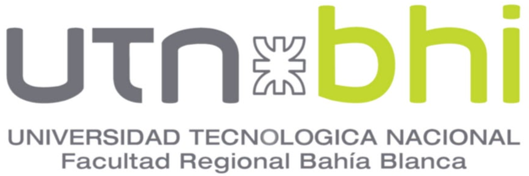
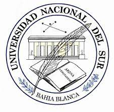

# LUCAS JEREMIAS FASSI

**Cloud & Backend Engineer** · AWS Infrastructure · Docker · CI/CD  
📍 Bahía Blanca, Argentina · 🌐 Remote-ready

---

## 📬 Contact

**Email:** jeremiasfassi@gmail.com  
**Phone:** +54 2954 443595  
**LinkedIn:** [linkedin.com/in/jeremias-fassi](https://linkedin.com/in/jeremias-fassi)  
**GitHub:** [github.com/JereFassi](https://github.com/JereFassi)

**Languages:** Spanish (Native) · English (Advanced – B2+) · Portuguese (Basic)

---

## 👨‍💻 Professional Summary

Cloud and backend engineer with strong experience **designing, deploying, and operating AWS-based infrastructures** for web applications and business systems. Hands-on with IAM, EC2, S3, RDS, Lambda, CloudWatch, CodePipeline and CloudFormation, plus Docker, Linux and shell scripting.

Accustomed to **admin-level responsibilities** across multiple AWS accounts: access management, security hardening, monitoring, cost control and CI/CD automation. Background as a backend developer (Node.js/TypeScript, PHP) and university lecturer, which helps to communicate clearly with both technical and non-technical stakeholders.

> 🎯 **Currently seeking:** Part-time, remote cloud/infrastructure roles (AWS administration, DevOps support, infrastructure maintenance and automation).

---

## 🛠️ Core Skills

### ☁️ Cloud & Infrastructure (AWS)

- **IAM** · Users, roles, policies, least privilege
- **EC2** · Provisioning, hardening, backups, SSH access
- **S3** · Buckets, lifecycle, static hosting, backups
- **RDS** · PostgreSQL, MySQL; performance basics, backups, security
- **Lambda** · Serverless tasks, automation, integrations
- **CloudWatch** · Logs, metrics, alarms, dashboards
- **CI/CD** · CodeCommit, CodePipeline, Amplify (for web apps and APIs)
- **Networking** · VPC, subnets, security groups, basic routing
- **CloudFormation** · Infrastructure as Code templates

### 🔧 DevOps & Automation

- **Docker & Docker Compose** · Containerization for services
- **CI/CD** · Design and maintenance
- **Linux Administration** · Ubuntu, server hardening, systemd services
- **Shell Scripting** · Maintenance scripts, cron jobs
- **Monitoring & Alerting** · Grafana, Prometheus, CloudWatch, email/Discord/Slack notifications, etc.
- **Logging Basics** · Structured log pipelines

### 💻 Backend & Databases

- **Backend** · Node.js (TypeScript) and PHP for APIs and backends
- **Databases** · PostgreSQL, MySQL, UniVerse DB (schema design, queries, migrations)
- **Integrations** · External APIs (payments, government services, OTT, etc.)

### 📚 Other

- Git, GitHub, branching workflows
- Documentation and knowledge transfer
- Teaching and mentoring (university-level courses)

---

## 💼 Professional Experience

### Cloud & Backend Engineer

**EYCON** · [eycon.com](https://eycon.com)  
📍 Bahía Blanca, Argentina · 📅 2024 – Present

- Architect and manage AWS infrastructure for multiple client projects.
- Administer IAM users/roles/policies and multi-account access.
- Configure and maintain EC2, S3, RDS, Lambda, CloudWatch, CodePipeline, CloudFormation, etc.
- Implement and maintain CI/CD pipelines (CodeCommit + CodePipeline) for backend services.
- Monitor systems and optimize performance, addressing incidents related to deployments, networking and scaling.
- Support backend development in TypeScript (Node.js) and PHP for internal and client solutions.
- Collaborate with teams on security, cost optimization and infrastructure best practices.

### Senior Developer & Cloud / IT Junior

**ALEATOR S.R.L.** · [aleator.com.br](https://aleator.com.br)  
📍 Bahía Blanca, Argentina · 📅 2018 – 2024

- Analyzed requirements, developed, implemented and supported the company's CRM web application.
- Managed AWS cloud infrastructure for the platform, including EC2, S3, RDS and related services.
- Designed and implemented integrations with external systems (AFIP, financial entities, OTT platforms, ISP provisioning APIs).
- Performed migrations from legacy client systems to the new CRM, including data migration and deployment planning.
- Contributed to infrastructure monitoring, backup strategies and environment configuration.

### Cloud Admin (Remote)

**FANTASTIC LLC** · [fantastic.app](https://fantastic.app)  
📍 San Francisco, USA (Remote) · 📅 2022 – 2023

- Administered AWS infrastructure for a social network + blockchain product.
- Managed IAM, EC2, S3, RDS, Amplify, CodeCommit, CodePipeline, CodeDeploy and related pipeline configurations.
- Supported security, networking (VPC, security groups) and logging/monitoring through CloudWatch and Lambda notifications.
- Participated in the definition of infrastructure standards and deployment practices for the team.

### Junior Developer

**CONTROL SERVICE** · [control-service.com.ar](https://control-service.com.ar)  
📍 Bahía Blanca, Argentina · 📅 2012 – 2018

- Re-engineering of the company's main management system, Windows Desktop application.
- Migrated legacy Visual Basic + AccessDB application to Java + SQL Server.
- Integrated remote devices and updated reports and documentation.

---

## 🎓 Academic Experience

### Lecturer – Technical Degree in Programming

**Universidad Tecnológica Nacional (UTN – FRBB)**  
📍 Bahía Blanca, Argentina · 📅 2025 – Present

**Courses taught** (64 hours each):

- Arquitectura y Sistemas Operativos
- Metodología de Sistemas II

**Responsibilities:**

- Design and deliver theoretical and practical content on operating systems, software architecture, Docker, Git and DevOps practices and culture.
- Guide student projects and contribute to academic planning and evaluation.

---

## 🎓 Education

### Computer Systems Engineer (MEQ)

**[Universidad Nacional del Sur](https://uns.edu.ar)** – Bahía Blanca, Argentina  
**[Computer Science Department](https://cs.uns.edu.ar)**

**Final Project (Thesis):**  
_"Aulas Sustentables: Automation System based on IoT for the Optimization of Electric Energy"_

- IoT-based classroom automation integrated with cloud services
- 🏆 **Awarded 3rd place** in the "Final Degree Projects" category at CoNaIISI 2020 (Congreso Nacional de Ingeniería Informática – Sistemas de Información)
- 📂 **Repository:** [github.com/uns-tesis-fassi-salazar/tesis](https://github.com/uns-tesis-fassi-salazar/tesis)

---

## 📜 Additional Training

- **Fullstack – Python** (208 hours)
- **Django – Python** (208 hours)

---

## 🎯 Focus for Part-time Roles

**Open to:**

- ☁️ AWS administration and maintenance (10–20 hours/week)
- 🔧 Infrastructure & DevOps support for existing products
- 🔄 CI/CD setup and improvements (CodePipeline, GitHub Actions, etc.)
- 🐧 Linux server administration, monitoring, automation and basic security hardening
